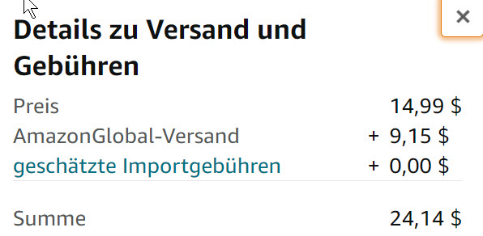

## Dokumentation des Projekts Währungsrechner

### Situation

Mittlerweile kann man weltweit Waren im Internet bestellen. Oft sind die Preis dann in anderen Währungen angegeben. 



Wie viel EURO werden hierfür nun vom Konto abgebucht? 

### Was soll das Programm können?
In einem Webformular kann man in der ersten Basisversion eine Zielwährung aussuchen und einen Betrag (in EUR) eingeben. Das Programm berechnet dann den zugehörigen Betrag in der Zielwährung und zeigt das Ergebnis an.

### Was können wir dabei lernen?
1. Lernen wie man eine Liste mit divs tabellarisch anzeigt.

2. Arbeiten mit Dropdownlisten

3. Fehlersuchen und beheben mit den Entwicklertools im Browser 
4. Fehlerbehandlung im Code (try - catch - finally)

5. Code-Dateien mit Hilfe von Git verwalten
6. Lernjournal in Markdown zu den Punkten 1. - 5. erstellen

### Wie gehen wir hier vor?
Planen Sie gemeinsam in ihrer Projektgruppe: Was wollen Sie in welcher Reihenfolge angehen?

### Ressourcen zu den Punkten 1-5
1. Werte tabellarisch mit divs darstellen
* [Tutorial zu Templatestrings](https://wesbos.com/template-strings-html)

2. Dropdownlisten mit Javascript füllen
* Beispiel für eine Liste in HTML
Diese können Sie ausprobieren auf ihrer ined.html-Seite. 
```js
<label for="pet-select">Choose a pet:</label>

<select name="pets" id="pet-select">
    <option value="">--Please choose an option--</option>
    <option value="dog">Dog</option>
    <option value="cat">Cat</option>
    <option value="hamster">Hamster</option>
    <option value="parrot">Parrot</option>
    <option value="spider">Spider</option>
    <option value="goldfish">Goldfish</option>
</select>
```

* [Im Programm die Auswahl erst erstellen](https://www.javascripttutorial.net/javascript-dom/javascript-add-remove-options/)

3. Fehlerarten und Fehlersuche<br>
* [Fehlerarten](https://www.rithmschool.com/courses/intermediate-javascript/javascript-debugging-errors)

* [Mit der Registerkarte sources in den Browserentwicklungstools entwickeln](https://www.rithmschool.com/courses/intermediate-javascript/javascript-debugging-with-the-sources-tab)
* [Übungen zum Debuggen](https://www.rithmschool.com/courses/intermediate-javascript/javascript-debugging-exercises)
* [Debugging Referenz für Chrome](https://developers.google.com/web/tools/chrome-devtools/javascript/reference?hl=en#stepping)
* [Debugging Referenz für Firefox](https://developer.mozilla.org/de/docs/Tools/Debugger)
